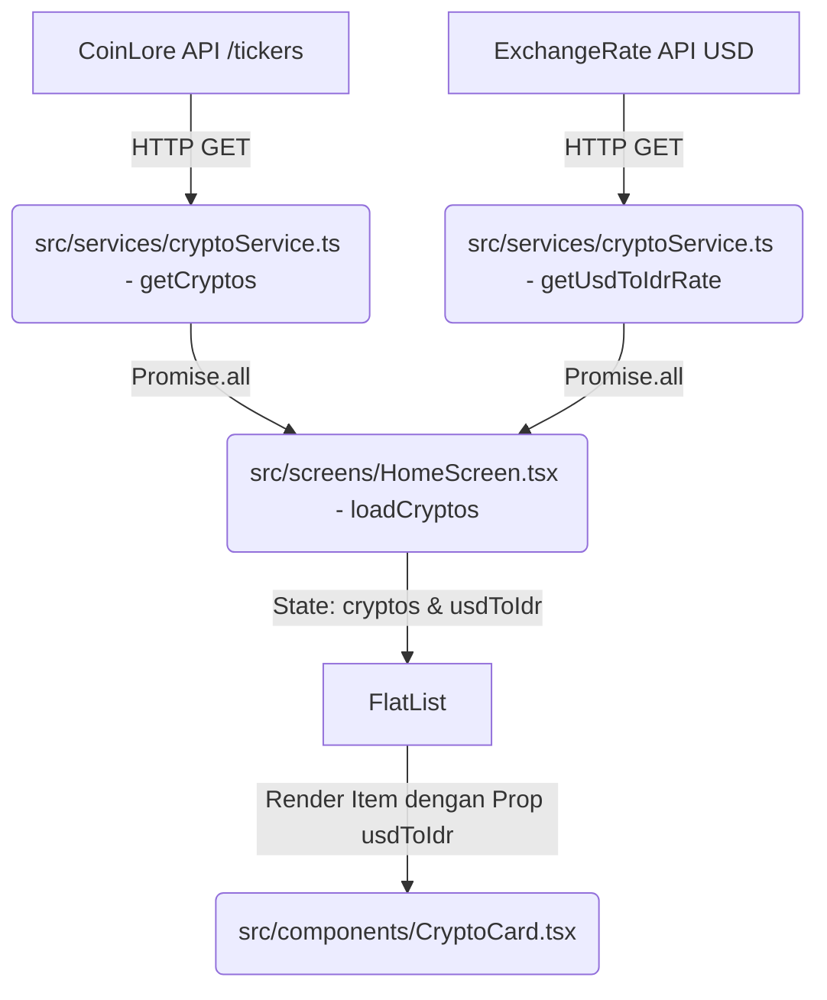

# Analisa Mendalam: Project Crypto Market (Updated)

Project ini adalah aplikasi mobile berbasis **React Native** dengan **TypeScript** dan **Expo SDK** yang berfungsi untuk menampilkan data harga cryptocurrency secara realtime menggunakan CoinLore API. Desain visual aplikasi ini terinspirasi oleh bursa kripto terkemuka seperti Binance/Tokocrypto, menggunakan tema gelap (dark mode) premium dengan aksen warna emas/kuning.

Aplikasi telah diperluas untuk menampilkan **real coin logo**, **statistik harga dalam Rupiah (IDR)** menggunakan kurs mata uang dinamis, serta **ikon aplikasi kustom premium**.

---

## 🛠️ Stack Teknologi

Aplikasi ini menggunakan beberapa dependensi dan framework utama berikut:
1. **Core Framework**: React Native (v0.81.5) & React (v19.1.0)
2. **Build Tool & Platform**: Expo (v54.0.20)
3. **Styling & UI Components**:
   - `react-native-paper` (v5.14.5) untuk komponen UI terstandarisasi seperti `Searchbar` dan `Button`.
   - `expo-linear-gradient` untuk efek gradient warna di kartu aset.
   - `@expo/vector-icons` (MaterialCommunityIcons) untuk ikon UI.
4. **Navigation**: `@react-navigation/native` & `@react-navigation/native-stack` (v7) untuk routing layar.
5. **Animation**: `react-native-reanimated` (v4) untuk animasi transisi masuk (*fade-in*) dan interaksi tombol (*press scaling*).
6. **Data Fetching**: `axios` (v1.11.0) untuk komunikasi HTTP dengan REST API.
7. **Type Safety**: TypeScript (v5.9.2) untuk pengetikan statis yang kuat.

---

## 📂 Struktur Project

Struktur folder teratur rapi di bawah direktori `src/` dengan arsitektur modular yang memisahkan tanggung jawab masing-masing bagian code:

```text
c:\Users\user\OneDrive\Documents\APLIKASI CRYPTOCURRENCY\
├── .expo/                   # File cache Expo
├── .git/                    # Repositori Git lokal
├── assets/                  # Aset gambar aplikasi (baru)
│   ├── icon.png             # Ikon utama aplikasi (1024x1024)
│   └── adaptive-icon.png    # Ikon adaptif Android (1024x1024)
├── src/                     # Folder sumber utama kode
│   ├── api/                 # Konfigurasi client API HTTP
│   │   └── coinloreApi.ts
│   ├── components/          # Komponen UI reusable (atom/molekul)
│   │   ├── CryptoCard.tsx   # Kartu representasi aset kripto & data statistik
│   │   ├── Header.tsx       # Header dengan branding & status LIVE
│   │   └── Loading.tsx      # Tampilan loading spinner
│   ├── interfaces/          # Definisi Type & Interface TypeScript
│   │   └── Crypto.ts        # Model data Crypto (mendukung statistik pasar & tren)
│   ├── navigation/          # Konfigurasi navigasi rute aplikasi
│   │   └── AppNavigator.tsx
│   ├── screens/             # Komponen level Halaman/Layar
│   │   └── HomeScreen.tsx   # Layar utama penampil daftar kripto & rate converter
│   ├── services/            # Logika integrasi API / Business Logic
│   │   └── cryptoService.ts # Mengambil ticker kripto & rate USD ke IDR
│   ├── theme/               # Konfigurasi style global & palet warna
│   │   └── colors.ts
│   └── App.tsx              # Root component (setup provider & navigation)
├── App.tsx                  # Entry point Expo utama (re-export dari src/App)
├── app.json                 # Konfigurasi metadata aplikasi Expo (Splash & Icon)
├── package.json             # Manajer dependensi & script proyek
└── tsconfig.json            # Konfigurasi compiler TypeScript
```

---

## 🔄 Alur Kerja Data & Integrasi Kurs (Data Flow)

Alur data berjalan secara searah (*unidirectional*) dan paralel untuk efisiensi pemuatan:



1. **Inisialisasi**: Saat `HomeScreen` pertama kali dimuat (*mount*), Hook `useEffect` memicu fungsi `loadCryptos()`.
2. **Pemuatan Paralel (Fetch)**: Menggunakan `Promise.all` untuk mengambil data secara paralel:
   - Data ticker koin dari CoinLore API (`getCryptos()`).
   - Nilai kurs USD ke IDR dari ExchangeRate API (`getUsdToIdrRate()`) dengan batas waktu (timeout) 5 detik dan fallback ke nilai `16.300` jika koneksi gagal atau offline.
3. **Penyimpanan State**:
   - Array koin disimpan ke state `cryptos`.
   - Kurs Rupiah disimpan ke state `usdToIdr`.
4. **Rendering dengan Konversi**:
   - `FlatList` merender setiap koin yang terfilter menggunakan komponen `CryptoCard.tsx`.
   - Komponen `CryptoCard` menerima properti `usdToIdr` untuk melakukan konversi real-time di sisi client.

---

## 🎨 Desain Sistem & Detil Komponen Terupdate

### 1. Sistem Warna (`src/theme/colors.ts`)
Mengadopsi palet warna gelap premium ala platform pertukaran aset digital:
- **`background`**: `#0B0E11` (Abu-abu sangat gelap hampir hitam, mengurangi ketegangan mata).
- **`card`** / **`cardHighlight`**: `#1E2329` / `#252B33` (Warna kontras untuk memisahkan area data).
- **`accent`**: `#F0B90B` (Warna kuning/emas khas Binance untuk fokus interaksi).
- **`success`** / **`error`**: `#0ECB81` / `#F6465D` (Hijau/merah neon standar industri kripto untuk indikasi tren positif/negatif).

### 2. Komponen UI Baru & Fitur Real-Time Rupiah
- **Ikon Aplikasi Premium (App Icon & Logo)**:
  - Telah dibuat desain logo minimalis berupa grafik koin emas bersilang dengan tren pasar menanjak berlatar belakang hitam doff premium.
  - Gambar ini ditempatkan di folder `/assets` dan dihubungkan di `app.json` sebagai `icon` utama serta `adaptiveIcon` Android.
- **Real Coin Icon (Logo Koin Asli)**:
  - Kartu memanggil logo aset melalui URL CDN CoinCap: `https://assets.coincap.io/assets/icons/[symbol]@2x.png` dalam huruf kecil.
  - Untuk menjaga kehandalan aplikasi jika koin baru/kurang populer belum memiliki logo di CDN atau jika pengguna sedang offline, sistem memiliki mekanisme **Fallback otomatis** menggunakan state `imageError`. Jika memicu event `onError` pada komponen `Image`, kartu akan secara anggun mengganti logo dengan inisial nama koin berselimut latar belakang emas khas.
- **Statistik Harga Utama (IDR & USD)**:
  - **Harga IDR (Utama)**: Dihitung secara real-time dan diformat menggunakan `Intl.NumberFormat('id-ID', { currency: 'IDR' })`. Nilai di bawah Rp100 diformat dengan desimal untuk menjaga presisi koin micin, sedangkan nilai besar dibulatkan tanpa angka desimal agar UI tetap rapi.
  - **Harga USD (Sekunder)**: Ditampilkan tepat di bawah harga Rupiah dengan font abu-abu lebih kecil sebagai referensi pasar global.
- **Perubahan Harga 24 Jam**:
  - Terdapat lencana (*badge*) pergerakan harga di samping simbol koin yang berwarna hijau dengan ikon segitiga atas jika naik (`+X.XX%`), dan merah dengan ikon segitiga bawah jika turun (`-X.XX%`).
- **Bagian Informasi Statistik Bawah (Dashboard Detail)**:
  - Untuk memberikan kedalaman statistik pasar, kartu dibagi menjadi dua baris dengan garis pembatas tipis. Baris bawah menampilkan:
    1. **KAP PASAR (Market Cap)**: Dikonversi ke Rupiah dan diformat secara dinamis dengan singkatan lokal seperti **T** (Triliun) atau **M** (Miliar).
    2. **VOLUME (24J)**: Volume perdagangan 24 jam terakhir dalam Rupiah dengan format kelipatan besar.
    3. **TREN (7H)**: Tren harga 7 hari terakhir dilengkapi ikon grafik naik/turun berwarna dinamis.
